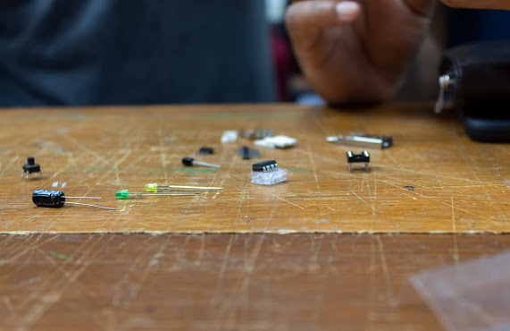
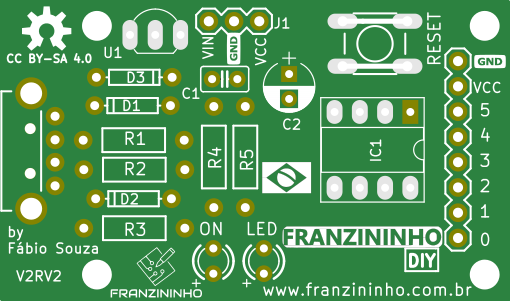
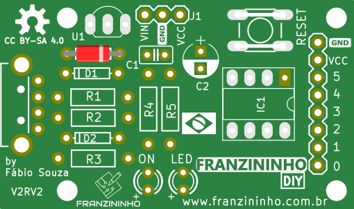
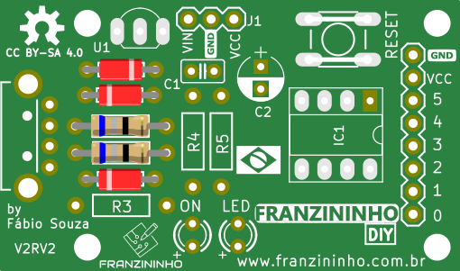
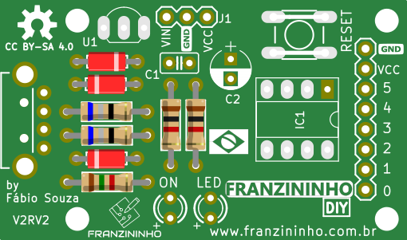
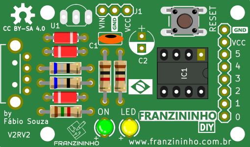
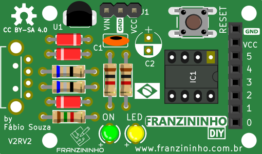
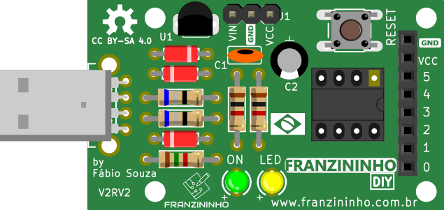
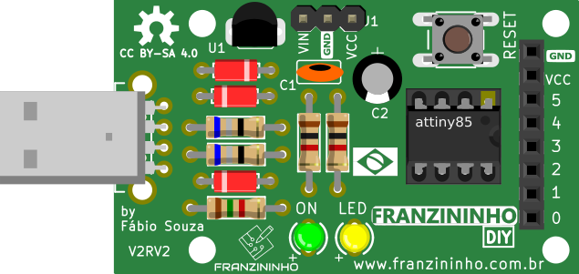

Passo a passo da montagem da Franzininho DIY V2RV2

### Antes de colocar a mão na massa

Antes de tudo você deve preparar o ambiente, separando as ferramentas necessárias para a soldagem. Vamos precisar de:

- Ferro de solda;
- Estanho;
- Alicate de corte diagonal para eletrônica;
- Óculos de proteção;

Você também deve separar os componentes para facilitar na hora de soldar. Você encontra os componentes na [lista de materiais](FranzininhoDIY/lista-de-materiais.md). Tudo organizado? Então vamos lá?!

### Montando a sua Franzininho DIY

De início você terá uma placa sem componentes, conforme a imagem abaixo:

:::tip Sequência de montagem
Você deve sempre começar pelos componentes baixos. Siga a sequência recomendada abaixo.
:::

### Diodo 1N1448

O primeiro componente a ser colocado é o diodo 1N4148 no **D3**.

:::caution Atenção
Cuidando com a polaridade do diodo. A faixa preta do diodo deve ser colocada conforme o desenho do componente na placa.
:::

### Diodos Zener (3V6)

Temos dois diodos zeners que deverão ser colocados nas referências **D1** e **D2**.

:::caution Atenção
Cuidado com a polaridade do diodo. A faixa preta do diodo deve ser colocada conforme o desenho do componente na placa.
:::

### Resistores de 68R

Nas referências **R1** e **R2** você irá colocar os resistores de 68R que são representado pelas cores (azul, cinza, preto e dourado).

  

### Resistor 1k5

Em **R3** deve-se colocar o resistor de **1k5** que é representado nas cores (marrom, verde, vermelho e dourado).

### Resistores 1k

Resistores de **1k** que são representados nas cores (marrom, preto, vermelho e dourado) devem ser colocados em **R4** e **R5**.

  

### Soquete 8 pinos

O soquete deve ser colocado no **IC1** que traz a facilidade do encaixe do ATtiny85.

:::caution Atenção
Verifique a posição do soquete a meia lua deve ficar virada para o lado do barramento de pinos da placa.
:::

### Chave táctil

  A chave você consegue colocar apenas em uma posição, então é só encaixá-la onde está localizada como **RESET**.

  

### Capacitor Cerâmico

No **C1** você irá colocar o capacitor cerâmico.  

  

### LED Verde  

O LED verde deve ser colocado no **ON**.  

:::caution Cuidado com polaridade dos terminais dos LED.
**Terminal maior (positivo) - Terminal menor (negativo)**
:::

  

### LED Amarelo

O LED amarelo deve ser colocado no **LED**.

:::caution Cuidado com polaridade dos terminais dos LED.
**Terminal maior (positivo) - Terminal menor (negativo)**
:::

  

### Regulador de tensão  

No **IC2** você deve colocar o regulador. Ele tem 3 terminais e deve ser colocado conforme o desenho na placa.

:::tip Siga o desenho do componente na placa para se orientar no encaixe.
:::

  

### Barra de 3 pinos

Em **J1**, onde está indicado com **VIN, GND, VCC**, você irá colocar a barra com três pinos.

  

### Barra de 8 pinos

Deverá ser colocada onde estão indicados **(GND, VCC, P6, ..., P1,P0)**

:::tip Apoie bem a barra. Solde apenas um terminal e verifique se ela ficou alinhada.
:::

### Capacitor eletrolítico

Agora vamos colocar o capacitor eletrolítico em **C2**.

### Conector USB

Quase lá! Iremos agora colocar o conector USB, conforme o encaixe dele.

### ATtiny85

Por último iremos colocar o microcontrolador ATtiny85 no soquete de 8 pinos.

:::caution Tome cuidado com a posição de encaixe do microcontrolador. Se oriente pelo desenho do soquete e faça uma dupla checagem antes de ligar a placa.
:::

Pronto!

Sua Franzininho versão V2RV2 está montada, agora é só programar e criar vários projetos.
