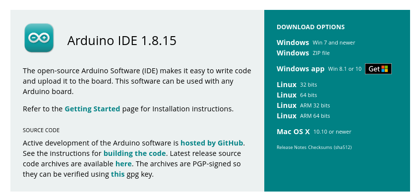
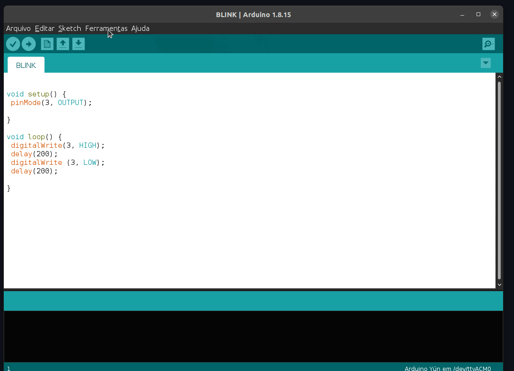
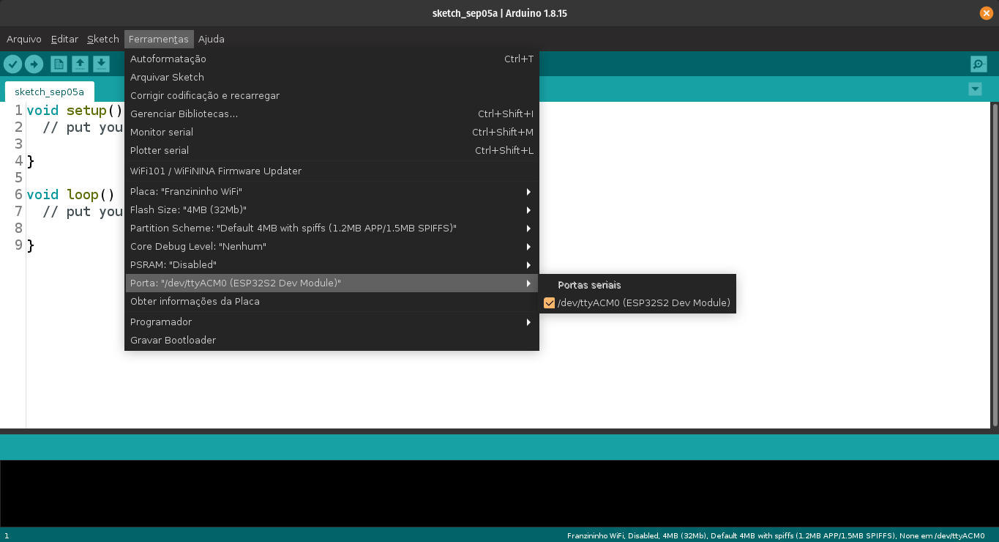
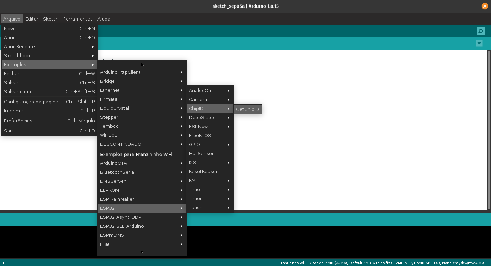
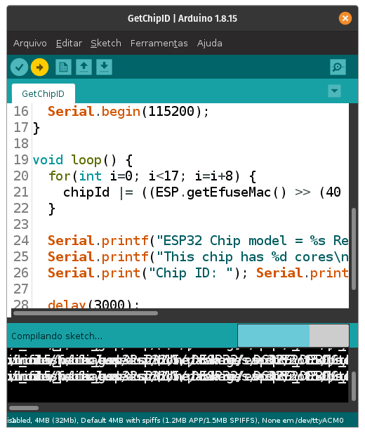
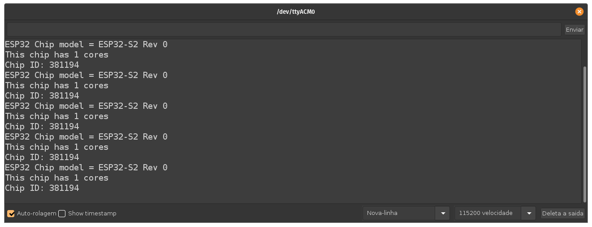

A Franzininho WiFi foi adicionada recentemente a plataforma Arduino através do pacote para ESP32 da Espressif. Essa foi uma contribuição do Pedro Minatel para o projeto Franzininho. Pedro enviou um PR com a adição da Franzininho WiFi no modo CDC e também como MSC.  

Nesse tutorial aprenderemos configurar a Arduino IDE e fazer o upload de código para a placa Franzininho WiFi.  

Usamos como base para esse tutorial a documentação da Espressif para Arduino: [https://docs.espressif.com/projects/arduino-esp32/en/latest/](https://docs.espressif.com/projects/arduino-esp32/en/latest/)  

## Arduino IDE  

Arduino é uma plataforma de prototipação de projetos eletrônicos composta por placas e uma interface de programação chamada Arduino.  

Antes de começarmos as configurações é importante que você instale a Arduino IDE em seu sistema operacional. Acesse: [https://www.arduino.cc/en/software](https://www.arduino.cc/en/software) e baixe a versão adequada para o seu sistema operacional.  

Estamos usando para esse tutorial a Arduino IDE 1.8.15, recomendamos essa versão ou superior.  

## Instalação do pacote ESP32 para Arduino

Para instalação do pacote ESP32 para Arduino usaremos a ferramenta Gerenciador de placas na própria IDE.  

Siga os seguintes passos:

1. Abra a Arduino IDe e acesse Arquivos -> Preferências;
2. Cole em “URLs adicionais para Gerenciadores de Placas” a seguinte URL:
`https://raw.githubusercontent.com/espressif/arduino-esp32/gh-pages/package_esp32_index.json`
3. Clique em OK;
4. Vá em Ferramentas > Placa > Gerenciador de Placas;
5. Ao abrir, procure por ESP32-S2, e clique em instalar;

Veja como o passo a passo na imagem abaixo:

Pronto, agora é só ir em placa e procurar pela Franzininho WiFi:

Faça a seguinte configuração:

Agora faremos um exemplo para verificar o processo de upload.

Abra o exemplo GetChipID:

Agora faremos o upload para a placa. Se for a primeira vez que você usará a Arduino IDE para programar a Franzininho WiFi você deverá colocar a placa em modo DFU para carregar o código. Após isso não precisará mais fazer esse procedimento.

Isso deverá sempre ser feito se você programar a placa com outras plataformas como ESP-IDF, CircuitPython, etc.

Colocando a placa em modo DFU

1. Plugue a placa na USB;

2. Pressione o botão Boot e segure;

3. Pressione o botão Reset e solte em seguida;

4. Solte o botão Boot.

Para fazer carregar o código na placa clique em Upload:

Abra o monitor serial e configure a velocidade para 115200 bps:

Será exibido o modelo e chip ID.

Agora você pode carregar qualquer código para a placa sem precisar colocá-la em modo DFU.

:::tip 
A Franzininho WiFi MSC funciona da mesma forma para upload via Arduino IDE. A diferença é que nesse modo podemos carregar binários sem uso da IDE, apenas carregando o binário para o dispositivo de armazenamento criado no computador.
:::

