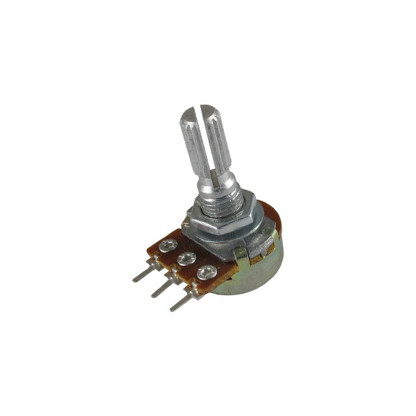
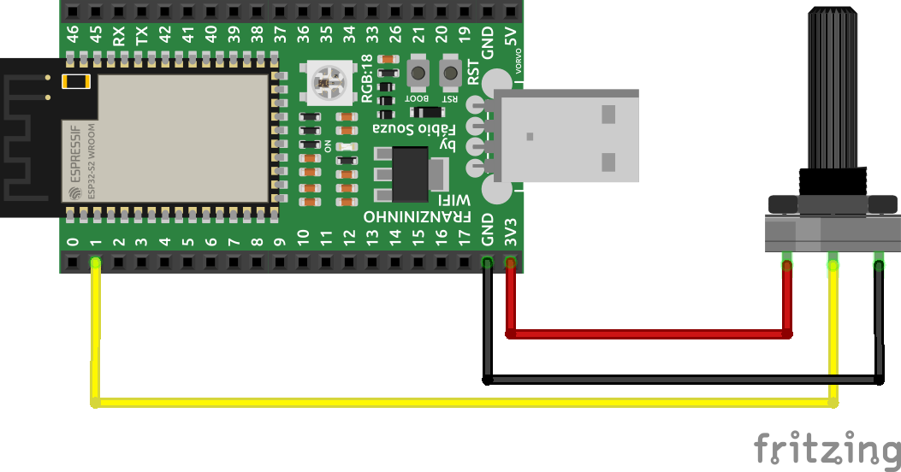
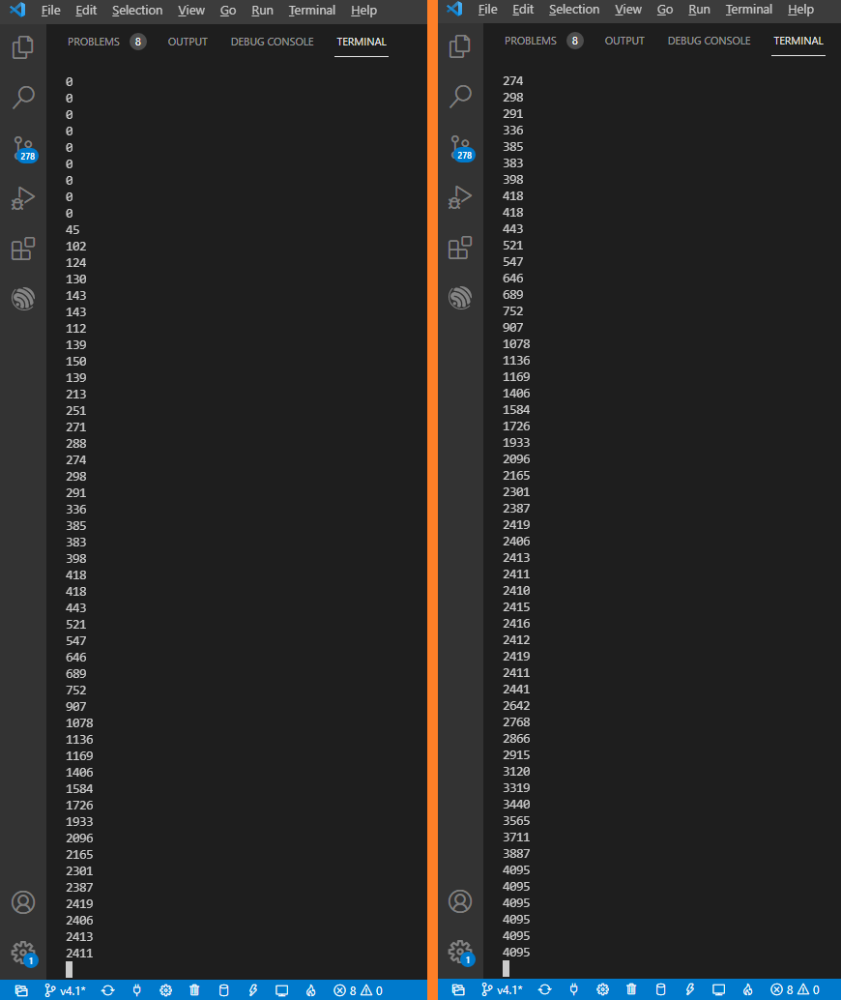

Nesse exemplo vamos entender como usar o Conversor Analógico-Digital  (Analog to Digital Converter(ADC)) na Franzininho WiFi. O objetivo deste  exemplo é apresentar projeto simples para configurar o ADC, ler o valor  de uma entrada analógica controlada por um potenciômetro e imprimir o  valor da conversão através da comunicação serial. Ao final, estaremos  preparados para fazer leitura analógica simples como também para  utilização de sensores mais complexos.

## Recursos

- Placa Franzininho WiFi
- Potenciômetro
- Protoboard
- Jumpers
- Computador com ESP-IDF instalado e configurado.

## Desenvolvimento

Um potenciômetro é um dispositivo analógico rotativo operado mecanicamente por meio de Um potenciômetro é um dispositivo analógico rotativo operado mecanicamente por meio de 3 terminais, ele fornece uma quantidade variável de resistência quando seu eixo é girado. Quando uma tensão é aplicada nos terminais do potenciômetro, que está conectado a uma entrada analógica, conseguimos medir uma resistência produzida pelo potenciômetro como um valor analógico.



O Conversor Analogico-Digital é um dispositivo que converte um sinal analógico num sinal digital. Logo, este exemplo vem com o intuito de monitorar o estado do potenciômetro a partir de uma comunicação serial, assim podemos ter base para trabalharmos futuramente com sensores analógicos.

Conecte os três fios do potenciômetro à sua placa. O primeiro fio vai de um dos pinos externos do potenciômetro para o GND. Já o segundo vai do outro pino externo do potenciômetro para 3,3 Volts. E por último, o terceiro vai do pino do meio do potenciômetro ao pino analógico GPIO1.

Quando se gira o potenciômetro, altera-se a resistência, impactando diretamente no pino central do potenciômetro, portanto, muda-se a tensão. Quando o eixo é girado no sentido direito a tensão se aproxima de 3,3V, ao contrário se aproxima de 0. Essa tensão que você está lendo na entrada analógica.

A Franzininho WIFI possui 20 entradas de ADC, sendo que o ADC1 possui 10 canais configurados do GPIO1 ao GPIO10, já o ADC2 possui 10 canais configurados do GPIO11 ao GPIO20. O conversor analógico-digital da ESP32-S2 que iremos utilizar possui 12bits de resolução, portanto, ele lê a tensão e a converte em um número entre 0 a 4095. A função adc1_get_raw() irá fazer a captura da quantidade de tensão aplicada ao pino do canal configurado.

### Esquemático



Em uma protoboard, conecte os três fios do potenciômetro na Franzininho WIFI. O primeiro vai de um dos pinos externos do potenciômetro para o GND. O segundo vai do outro pino externo do potenciômetro para 3,3 volts. O terceiro vai do pino do meio do potenciômetro ao pino analógico GPIO1.

### Código

```c
/*
    Autor : Kayann Soares
    Utilização simples da Leitura de Dados Analogicos.
*/

// Bibliotecas Necessarias
#include <stdio.h>
#include "sdkconfig.h"
#include "freertos/FreeRTOS.h"
#include "freertos/task.h"
#include "esp_system.h"
#include "esp_spi_flash.h"
#include <driver/adc.h>

// Main
void app_main(){

  // Configurando a resolução do ADC para 12bits        
  adc1_config_width(ADC_WIDTH_BIT_12);
  // Configurando o Channel do ADC para o Channel 0
  adc1_config_channel_atten(ADC1_CHANNEL_0,ADC_ATTEN_DB_11);


  while(1){

    // Função que de leitura do valor analogico, passando o ADC1 que é o do GPIO1
    int sensorValue = adc1_get_raw(ADC1_CHANNEL_0);

    // Imprimindo valores lidos
    printf("%d\n", sensorValue);

    // Rotina de Delay de 1 segundo
    vTaskDelay(1000 / portTICK_PERIOD_MS);
    // Descarrega os buffers de saída de dados
    fflush(stdout);

  }
}


```

### Compilação

Após a codificação vamos compilar o código, mas antes selecione o set-target para ESP 32-S2:

```
idf.py set-target esp32s2
```

Após a compilação vamos enviar o código fonte para nossa placa, no editor pressione o ícone de raio para dar o FLASH e aguarde alguns segundos para assim dar início ao programa


Para vermos a saída de dados do nosso projeto clique no ícone no formato de monitor:


### Resultados

Valores mostrados no terminal quando o potenciômetro é rotacionado.



## Conclusão

Concluímos o estudo do periférico base para iniciar no desenvolvimento com microcontroladores da Espressif usando o Framework IDF, a partir desse artigo podemos replicar para as demais famílias do ESP32, estes conceitos podem ser levados também para trabalharmos com outros microcontroladores que utilizem C e uma programação mais abstrata. Este artigo visa no estudo do periférico ADC, ao final deste projeto é possível aprender a utilizar o ADC da Franzininho WiFi para leitura de dados analógicos e lhe dará o desafio de aplicar esse aprendizado na leitura de sensores analógicos para você aplicar em seus projetos utilizando o ESP-IDF. Bons estudos.

| Autor | [Kayann Soares](https://www.linkedin.com/in/kayann-soares/) |
|-------|-------------|
| Data: | 01/06/2021  |
