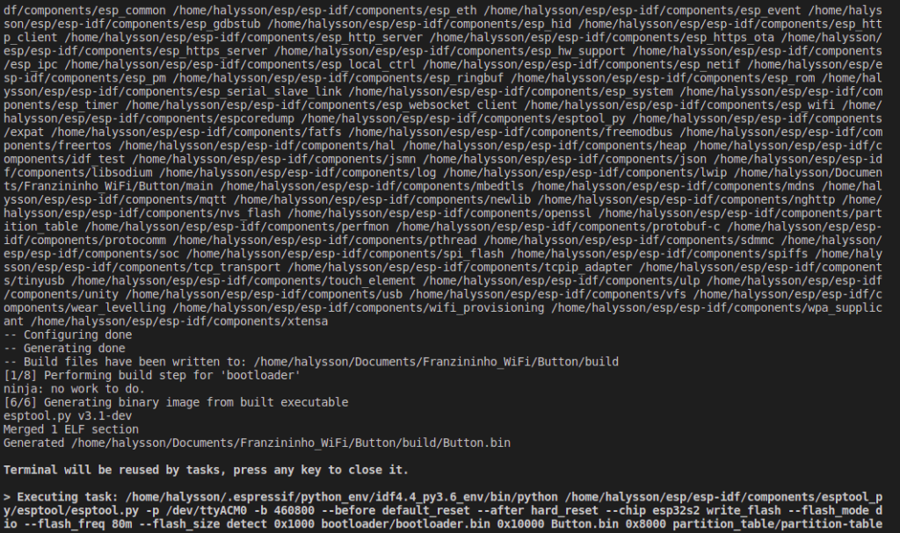
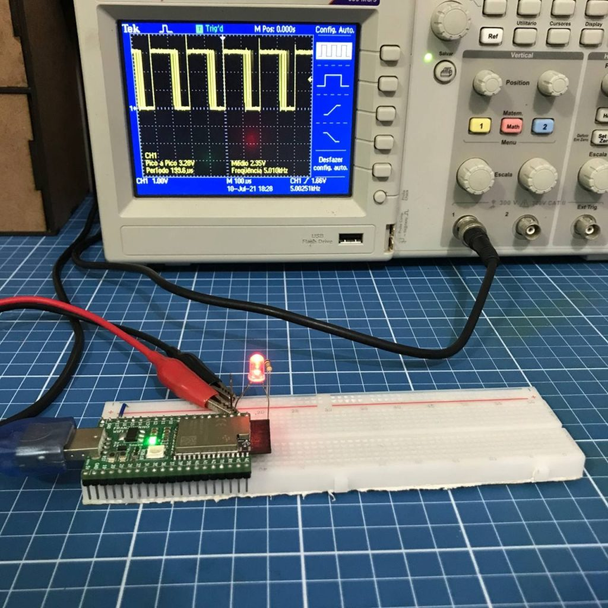
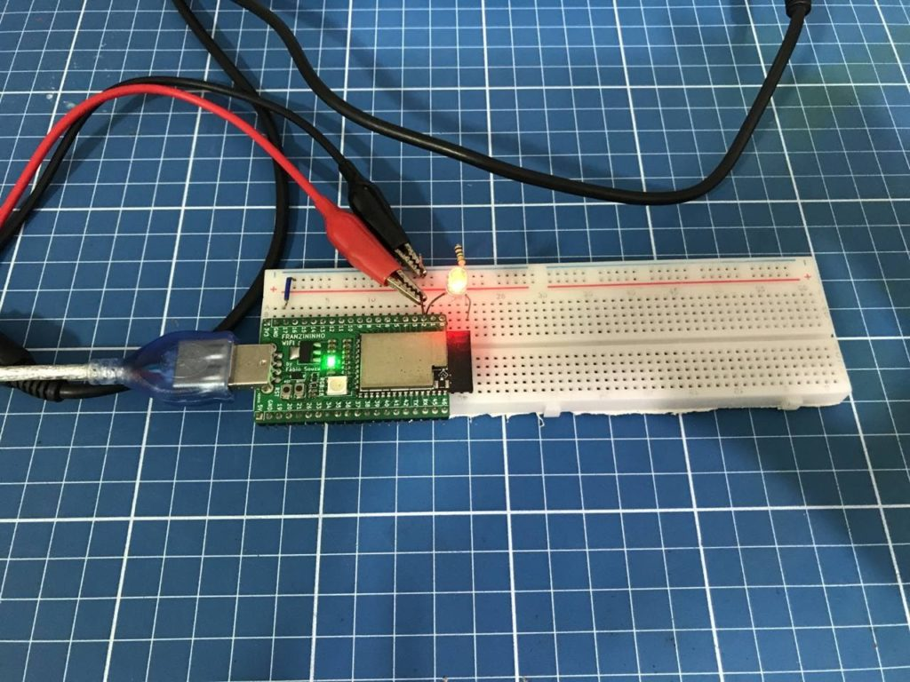

Seguindo os estudos do ESP-IDF, vamos agora estudar um novo periférico, o LED Control (LEDC), o qual tem a função de controlar a intensidade luminosa do LED e também servir como fonte geradora de sinal pulsado, **Pulse Width Modulation** (PWM), para diferentes propósitos como: controle de velocidade em motores de corrente contínua (CC), angulação em servomotores, mudança de cores em LED RGB e outras mais aplicações.

Com isso, ao final deste artigo estaremos familiarizados com os recursos oferecidos pelo periférico além de dominar as configurações básicas para implementar em projetos.

## **Recursos Necessários**

Os materiais necessários para realizar esse exemplo são:

- Placa Franzininho WiFi;
- Protoboard;
- LED;
- Resistor de 220 Ohm;
- Cabos Jumpers;
- Computador com ESP-IDF instalado e configurado.

## **Desenvolvimento**

Na placa Franzininho WiFi o periférico LEDC está disposto em dois grupos de oito canais, sendo um grupo operando no **High Speed Mode (HSM)** e outro em **Low Speed Mode (LSM)** operando independente uns dos outros **.** O modo High Speed é implementado em hardware oferecendo mudanças automáticas sem interferir no duty cycle do PWM, ou seja, caso haja alterações na temporização serão atualizadas no próximo estouro do timer. Em contraste isso o modo Low Speed deve ser explicitar o via software as configurações de temporização.

Para utilizarmos esse periféricos precisamos seguir algumas etapas fundamentais para nossa aplicação de estudo que são: Configuração do Temporizador , Configuração do Canal e Alteração do PWM.

- Configuração do Temporizador : nessa primeira etapa vamos especificar a frequência e a resolução do sinal PWM preenchendo a estrutura de dados [**ledc_timer_config_t**](https://docs.espressif.com/projects/esp-idf/en/latest/esp32/api-reference/peripherals/ledc.html#_CPPv419ledc_timer_config_t) e apontando-a para a função **led_timer_config() .**

- Configuração do Canal: nessa segunda etapa iremos direcionar o GPIO que será a saída do sinal PWM, o qual é selecionado dentro da estrutura de configuração do periférico.

- Alteração do PWM: na última etapa vamos realizar o aumento e a redução do duty cycle na saída da geradora de sinal criando assim o **fade** no LED externo, o qual será habilitado via hardware pela função [**ledc_fade_func_install()**](https://docs.espressif.com/projects/esp-idf/en/latest/esp32/api-reference/peripherals/ledc.html#_CPPv422ledc_fade_func_installi)**.**

Com a finalização das três etapas de configuração o acionamento do periférico LED Control estará em funcionamento, contudo devemos agora seguir para montagem do circuito para concluir o projeto.


### **Esquemático**

Nesta parte daremos início a montagem do circuito em protoboard, iremos conectar um dos terminais do resistor no **GPIO 2** e outro no LED externo.

Abaixo segue o esquemático proposto :


### **Código**

```c
/*
   Autor: Halysson Junior
   Data : 10/04/21   

    Nesse exemplo foi configurado o periferico LEDC para controlar a intensidade do LED.
     
*/

// Inclusão de arqivos de cabeçalho
#include <stdio.h>
#include "freertos/FreeRTOS.h"
#include "freertos/task.h"
#include "driver/ledc.h"
#include "esp_err.h"

// Definição para configuração do periférico
#define LEDC_GPIO         2
#define LEDC_FADE_TIME    500
#define LEDC_RESOLUTION   1024
#define LEDC_FREQ         5000


void app_main(void) // Main
{

  //  Estrutura de dados para receber  as váriaveis  de configuração de frequência (1Hz, 100 Hz e outros), modo (HIGH ou LOW) e selecionar o TIMER (0,1,2)  
  
  ledc_timer_config_t timer = {                   // Configuração do timer 

      .speed_mode      = LEDC_LOW_SPEED_MODE,     // Modo de Velocidade -> LOW
      .duty_resolution = LEDC_TIMER_10_BIT,       // Resolução do do ciclo de trabalho (2^10 = 1024 valores)
      .timer_num       = LEDC_TIMER_0,            // Utilizado o TIMER 0
      .freq_hz         = LEDC_FREQ,               // Frequência de operação do sinal PWM
      .clk_cfg         = LEDC_AUTO_CLK            // Seleção automatica da fonte geradora do clock (interna ou externa)
    
  };

  
  ledc_timer_config(&timer); // Envia o endereço  da estrutura timer para a função de configuração do canal PWM 
 
 /*
   NOTA:
   A frequencia e a resolução do ciclo de trabalho são independentes. Para uma elevada frequência do PWM, 
   terá uma baixa resolução do ciclo de trabalho disponivel e vice-versa  
 */

 //  Estrutura de dados para receber  as váriaveis  de configuração de frequencia (1Hz, 100 Hz e outros), modo (HIGH ou LOW), selecionar o TIMER (0,1,2) 
  
  ledc_channel_config_t channel_LEDC = {
      .gpio_num   =   LEDC_GPIO,             // Seleciona o pino para atuar o PWM
      .speed_mode =   LEDC_LOW_SPEED_MODE,   // Modo de Velocidade -> LOW
      .channel    =   LEDC_CHANNEL_0,           
      .timer_sel  =   LEDC_TIMER_0,
      .duty       =   0,
      .hpoint     =   0
    
    };
  
  ledc_channel_config(&channel_LEDC);
 
 
  ledc_fade_func_install(0); // Inicializa o serviço do Fade
  
  for(;;){ // Loop

   // Define e inicia a função de fade no periférico LEDC
    ledc_set_fade_time_and_start( channel_LEDC.speed_mode , channel_LEDC.channel , 0               , LEDC_FADE_TIME , LEDC_FADE_WAIT_DONE);
    ledc_set_fade_time_and_start( channel_LEDC.speed_mode , channel_LEDC.channel , LEDC_RESOLUTION , LEDC_FADE_TIME , LEDC_FADE_WAIT_DONE);
  
  
  }// endLoop

}//endMain

/*
 *** Paramentrização da função " ledc_set_fade_time_and_start(); " ***

ledc_set_fade_time_and_start(ledc_mode_tspeed_mode, ledc_channel_tchannel, uint32_t target_duty, uint32_t max_fade_time_ms, ledc_fade_mode_tfade_mode)

  ledc_mode_tspeed_mode     -> modo do timer utilizado
  ledc_channel_tchannel     -> indice do canal LEDC (0-7)
  uint32_t target_duty      -> (2 ** resolução_ciclo_de_trabalho) -  1
  uint32_t max_fade_time_ms -> tempo máximo (ms) para o fading  
  ledc_fade_mode_tfade_mode ->  
*/
```

O programa desenvolvido possui uma estrutura bem simples e não é necessário acrescentar nenhuma biblioteca, apenas a manutenção dos arquivos de cabeçalho já presentes no projeto.

Ao criar um novo projeto no IDF automaticamente já temos arquivos configurados e prontos para programação do dispositivo, desta forma digite e comente as linhas do seguinte código no arquivo **main.c :**

Você encontra o projeto completo na documentação da Franzininho: **PWM**

Caso ainda não tenha instalado e configurado o IDF no seu computador ou tenha dúvidas sobre as ferramentas, acesse o tutorial de instalação ([Clique Aqui](https://franzininho.github.io/exemplos-esp-idf/)).

### **Compilação**

Após a codificação vamos compilar o código, mas antes selecione o **_set-target_** para ESP32-S2. Caso não possua a placa Franzininho WiFi altere o target para o modelo de ESP32 utilizando em seu projeto.

    idf.py set-target esp32s2

Ao final da compilação o resultado final deve ser semelhante à imagem mostrada abaixo, em caso de erros retorne os passos anteriores e revise seu código.



Após a etapa de compilação vamos enviar o código fonte para nossa placa, no editor pressione o ícone abaixo e aguarde alguns segundos para assim dar início ao upload do programa “PWM” (seta preta) .


### **Resultados**

Após enviar seu código e com o circuito devidamente montado o LED externo conectado começará a aumentar e diminuir sua intensidade luminosa gradualmente criando o fade desejado. Na figura 5 temos a imagem do osciloscópio mostrando a forma de onda gerada e o duty cycle atuando no momento e na figura 6 o circuito em perfeito funcionamento.






## **Conclusão**

Neste exemplo apresentamos tópicos intermediários sobre a manipulação do periférico LED Control, utilizamos conceitos importantes da linguagem C estrutura de dados e ponteiros implementado na configuração do sinal pulsado.

Deve-se deixar claro que o artigo aborda um conteúdo para darmos os primeiros passo com este periférico, encorajamos que o leitor reconfigure a saída do sinal PWM como também acesse a documentação oferecida pela Espressif para compreender como o hardware do chip comporta-se com cada configuração realizada além das funções implementadas em software.

| Autor | [Halysson Junior](https://github.com/halyssonJr) |
|-------|-------------|
| Data: | 22/07/2021  |
